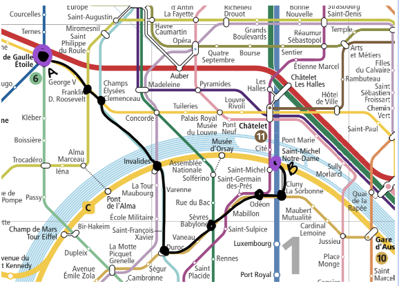

# Metro Mishaps

## Eleanor Irwin

### High Concept

A puzzle game to navigate a very confusing metro system–the Paris metro. Get from point A to point B as metro lines close or delay. The goal is to take as few lines as possible in the smallest amount of time. Bonus: learn the Paris transportation system!

### Features

- It’s a single player game: The player against the metro.
  The player is given a starting point and an ending point. For example, from the Arc de Triomphe to Notre Dame. Like so:
  

- The player is stopped at each station and prompted to choose between all available stations from their current station.

- Randomly throughout the game, imaginary scenarios occur, i.e lines go down, forcing the player to choose from fewer options. Lines can also pop back up randomly. This prevents the player from being able to plan out their route ahead of time; you never know when a line will go down.

- The game begins with navigation through only the first zone, but as they complete more levels, the map grows bigger and thus more confusing. In addition, imaginary scenarios occur more often and are much more difficult to work through.

- The goal is to take the quickest route. This is measured by a point system given to each option. There is also a timer going that pressures the player to go as quick as they can.

- To make the game accessible, there are options to get hints or modify the complexity.

### Player Motivation

Given a map of the metro system, a starting destination, and an ending destination, take the quickest route as possible while taking the shortest amount of time. The game will simulate unforeseen transportation mishaps, for which the player will change their travel plans.

### Genre

Mainly a puzzle game, but also a simulator.

### Target Customer

Puzzle lovers looking for something new. People moving to Paris who want to see if they have what it takes.

### Competition

None

### Unique Selling Points

- Dynamic puzzle
- Can help with learning public transportation
- Comedic simulation scenarios

### Target Hardware

Desktop

### Design Goals

- **Interactive:** The player gets to interact with the subway system.
- **Strategic:** Trying to get the fewest number of moves as possible, the player strategizes their next move.
- **Fast:** With a ticking time, the player tries to move as quickly as they can.
